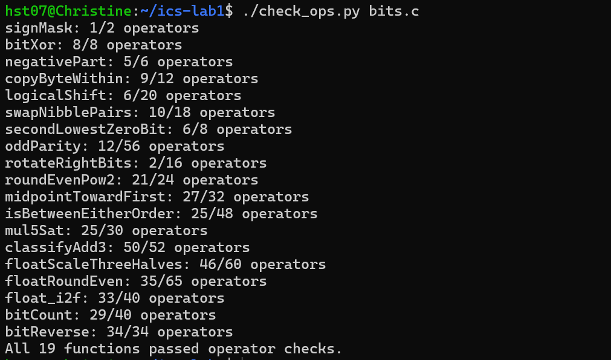
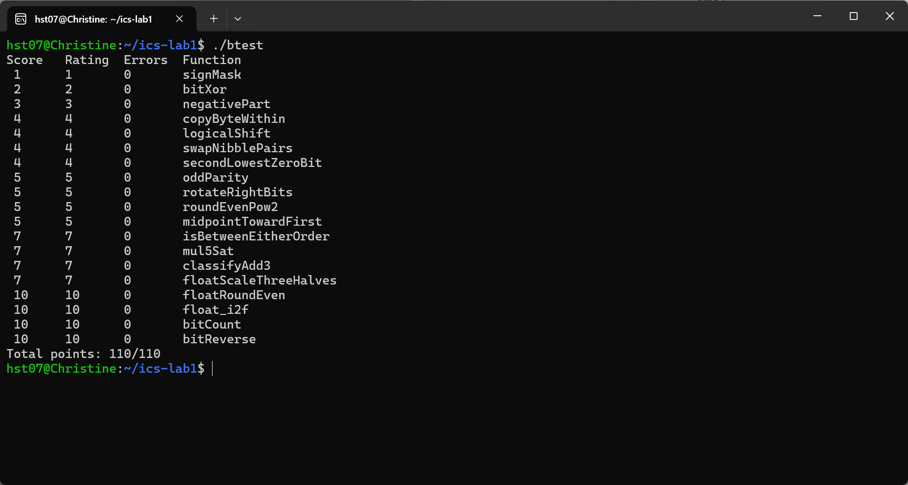
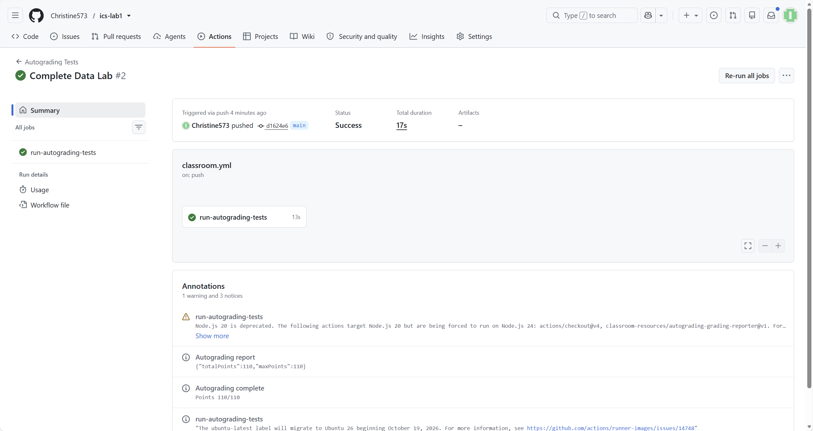

# ICS Lab 1：Data Lab 实验报告

## 一、实验信息

- 实验名称：ICS Lab 1 — Data Lab
- 姓名：[黄诗婷]
- 学号：[25803050112]
- GitHub 仓库：https://github.com/Christine573/ics-lab1
- 实验环境：Windows WSL Ubuntu，使用 32 位编译选项 `-m32`

## 二、实验目的

本实验要求在限定运算符、常量范围和操作数数量的条件下，实现一组整数位级函数和 IEEE 754 浮点数函数。通过本实验，我进一步熟悉了补码、算术右移、掩码、溢出判断、舍入以及浮点数的符号位、阶码和尾数字段。

## 三、实验环境与测试方法

我使用 Windows 上的 WSL Ubuntu 环境完成实验。主要命令如下：

```bash
make clean
make all
./check_ops.py bits.c
./btest
```

其中，`make all` 的编译命令包含 `-m32`，`check_ops.py` 用于检查每个函数的操作数限制，`btest` 用于检查函数输出是否正确。

## 四、测试结果

### 4.1 操作数检查



操作数检查结果显示，19 个函数全部通过操作数限制检查，其中 `bitReverse` 使用了规定上限的 34 个操作数。

### 4.2 功能测试



功能测试中每个函数的错误数均为 0，最终结果为 `Total points: 110/110`。

### 4.3 Github Actions 自动评分


## 五、各函数实现思路

### 1. `signMask`

利用 `1 << 31` 构造最高位为 1、其余位为 0 的掩码。这个掩码对应 32 位整数的符号位。

### 2. `bitXor`

利用德摩根律，只使用 `~` 和 `&` 构造异或。先分别得到“x 为 1 且 y 为 0”和“x 为 0 且 y 为 1”的部分，再把两部分合并。

### 3. `negativePart`

我先根据 x 的符号生成掩码，再利用补码取相反数的方式处理负数，最后让非负数返回 0。

### 4. `copyByteWithin`

将源字节位置和目标字节位置转换成对应的移位量，先用 `& 0xff` 取出源字节，再构造目标字节掩码。最后清除目标位置原来的内容，并把源字节移到目标位置。

### 5. `logicalShift`

C 语言中有符号整数右移是算术右移，会在左侧补符号位。因此先进行普通右移，再构造一个保留低位的掩码，将算术右移产生的高位符号扩展清除，从而模拟逻辑右移。位运算和移位规则参考了资料 资料<sup><a href="#ref2">[1]</a></sup>。

### 6. `swapNibblePairs`

先构造每个字节中低四位有效的掩码，再扩展到 32 位。取出每个字节的低半字节和高半字节，分别左移和右移 4 位后合并，实现相邻半字节交换。

### 7. `secondLowestZeroBit`

利用 `x + 1` 会从最低位的连续 1 开始产生进位这一性质，通过 `x` 与 `x + 1` 的关系定位零位，再从候选结果中取出目标位置。

### 8. `oddParity`

把一个 32 位数逐步折叠：先将高 16 位与低 16 位异或，再继续折叠到 8 位、4 位、2 位和 1 位。最后检查最低位，就可以得到 1 的个数是否为奇数。

### 9. `rotateRightBits`

我先计算右移部分，并用掩码清除算术右移产生的符号扩展；再把被移出的低位通过左移放回高位，最后用或运算合并两部分。

### 10. `roundEvenPow2`

我最开始只按照普通四舍五入处理余数，没有充分考虑“恰好在中点”的情况。测试边界值后发现，中点时不能总是进位，而要看当前商的最低位：商为奇数才进位，商为偶数则保持不变。修改后把数分成商和余数，并单独判断大于中点、等于中点且商为奇数这两种情况。

### 11. `midpointTowardFirst`

这里不能直接把两个数相加后除以 2，因为相加可能溢出。我先分别进行移位，再根据最低位和两个数的方向补偿结果。

### 12. `isBetweenEitherOrder`

计算 `x-a` 和 `x-b`，通过符号以及减法溢出情况判断 x 与两个端点的相对关系。最后分别处理端点顺序不同的情况，并排除等于端点的情况。

### 13. `mul5Sat`

用左移和加法计算 `5*x`，同时分别检查两倍、四倍以及最终相加过程中是否发生溢出。发生正溢出时返回最大正数，发生负溢出时返回最小负数，否则返回计算结果。

### 14. `classifyAdd3`

先计算三个数的和，并通过进位和符号变化判断加法过程中是否发生溢出。根据三个输入的符号数量以及最终结果符号，区分正常结果、正溢出和负溢出。

### 15. `floatScaleThreeHalves`

我最初的思路是把尾数乘以 3 后直接除以 2，但没有把规格化数和非规格化数分开，也没有完整处理舍入和阶码进位。后来测试发现边界输入的结果不正确，于是先拆分符号位、阶码和尾数，并单独处理 NaN/无穷大、非规格化数和规格化数。规格化数补上隐藏的最高位，计算乘以 1.5 后再根据余数进行 round-to-even 舍入。如果尾数进位，还要同步增加阶码。浮点数位级表示和舍入规则参考了资料 资料<sup><a href="#ref2">[3]</a></sup>。

### 16. `floatRoundEven`

一开始我只关注了普通数值的舍入，没有先按阶码区分小于 1、已经是整数和需要舍去小数的情况。经过测试后，我先根据阶码分类，再取出保留部分、舍弃部分和中间值，并在大于中间值或“恰好中间且保留部分为奇数”时进位。这样可以符合 round-to-even，而不是普通的总是向上舍入。

### 17. `float_i2f`

一开始我尝试使用显式类型转换处理负整数，但 `dlc` 检查时报告了 `Illegal cast`，说明这种写法不符合本实验的编码规则。之后我删除了显式转换，利用补码的按位取反和加一得到绝对值。接着找到整数最高位的位置来确定阶码，并根据舍弃部分、半位和保留部分最低位实现 round-to-even 舍入。

### 18. `bitCount`

使用分组掩码，先统计每两位中的 1 的数量，再合并为四位、八位和更大的分组。最后把各组结果相加并取出低位计数。掩码分组和位计数的思路参考了资料资料<sup><a href="#ref2">[2]</a></sup>。

### 19. `bitReverse`

我先采用逐级交换的方法实现位反转，但直接使用了 `0x55555555`、`0x33333333` 等完整掩码。虽然功能测试可以通过，但 `check_ops.py` 报告这些常量不符合只能使用 `0x00` 到 `0xff` 的限制。之后我尝试使用 `unsigned` 临时变量来避免有符号数右移时的符号扩展，但检查器又报告不允许使用 `unsigned` 类型。改回 `int` 后，代码功能正确，但操作数为 36 个，超过了规定的 34 个。最后通过复用同一个 `filter`，从允许的较小常量构造掩码，再依次完成 16 位、8 位、4 位、2 位和 1 位的交换，最终将操作数降低到 `34/34`。这种逐级交换比特的思路参考了资料资料<sup><a href="#ref2">[2]</a></sup>。

## 六、调试过程中遇到的问题

### 6.1 浮点函数的编译和边界情况

浮点函数不能直接使用 C 的浮点运算，而要把浮点数看成位模式处理。调试时我遇到过变量未声明和显式类型转换被 `dlc` 拒绝的问题。修改后，我通过重新运行 `make clean`、`make all` 和单个函数测试，逐步确认了问题。

### 6.2 `bitReverse` 的常量和操作数限制

`bitReverse` 的功能测试先通过了，但操作数检查失败。原因是直接写入了超过 `0xff` 的常量，而且后续为了处理有符号右移又尝试使用了不允许的 `unsigned` 类型。最后通过复用 `filter` 解决了常量和操作数两个问题。

### 6.3 提交前检查

提交前 `git diff --check` 检查出 `bits.c` 第 462 行有 trailing whitespace。删除行尾空格后再次检查，确认没有格式错误。之后使用 GitHub Actions 验证，最终报告显示 `110/110`。

## 七、参考资料

<a id="ref2"></a>[1] cppreference，C language arithmetic operators  
https://en.cppreference.com/w/c/language/operator_arithmetic

<a id="ref2"></a>[2] Sean Eron Anderson，Bit Twiddling Hacks  
https://graphics.stanford.edu/~seander/bithacks.html

<a id="ref2"></a>[3] Oracle，Numerical Computation Guide  
https://docs.oracle.com/cd/E19957-01/806-3568/806-3568.pdf

## 八、实验感受

本实验中最困难的部分是同时满足功能正确、操作数限制和允许常量限制。刚开始看到测试失败时，我容易只关注输出是否正确，而忽略了 `dlc` 对代码形式的限制。通过反复使用单函数测试和操作数检查，我逐渐学会了先区分“功能错误”“编译错误”和“规则错误”，再针对不同类型的问题修改代码。


